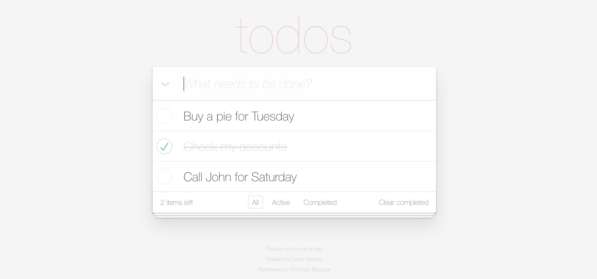

# Debug Todo list mvc app

## What is "Todos" for ?

"Todos" is an application for creating and managing todos on web browsers.
<br/>This Javascript application is developed according to the MVC architectural pattern.



1. <a href="#started">Getting Started</a>
2. <a href="#works">How it Works ?</a>
    - <a href="#app-js">app.js</a>
    - <a href="#store-js">store.js</a>
    - <a href="#model-js">model.js</a>
    - <a href="#view-js">view.js</a>
    - <a href="#controller-js">controller.js</a>
    - <a href="#template-js">template.js</a>
    - <a href="#helpers-js">helpers.js</a>
3. <a href="#jasmine">Launch Jasmine tests ?</a>

<a name="started" />

## Getting Started - Development

- Clone the repo:
```
git clone https://github.com/AlexBth86/debug-todo-list-mvc-app.git
```

<a name="works" />

## How it Works

"Todos" is based on a MVC architectural pattern and use VanillaJS.

<a name="app-js" />

### app.js

Sets up a brand new Todo list.
  - param {string} name The name of your new to do list.

<a name="store-js" />

### store.js

Creates a new client side storage object and will create an empty
<br/>collection if no collection already exists.

```
function Store(name, callback) {
  callback = callback || function () {};

  this._dbName = name;

  if (!localStorage[name]) {
    var data = {
      todos: []
    };

    localStorage[name] = JSON.stringify(data);
  }

  callback.call(this, JSON.parse(localStorage[name]));
}
```
#### Store prototypes methods

- Finds items based on a query given as a JS object with :

```
Store.prototype.find
```

- For retrieve all data from the collection use :

```
Store.prototype.findAll
```

- For save the given data to the DB. If no item exists it will create a new item, otherwise it'll simply update an existing item's properties

```
Store.prototype.save
```

- For remove an item from the Store based on its ID

```
Store.prototype.remove
```

- For drop all storage and start fresh

```
Store.prototype.drop
```

<a name="model-js" />

### model.js

Creates a new Model instance and hooks up the storage with :

```
function Model(storage) {
  this.storage = storage;
}
```
#### Model prototypes methods

- Creates a new todo model :
  - [title] is the title of the task
  - [callback] is the callback to fire after the model is created

```
Model.prototype.create
```

- For finds and returns a model in storage :

```
Model.prototype.read = function (query, callback) {...}
```

- For updates a model by giving it an ID, data to update, and a callback to fire when the update is complete :

```
Model.prototype.update
```

- For removes a model from storage :
```
Model.prototype.remove
```

- For removes ALL data from storage :
```
Model.prototype.removeAll
```

- For returns a count of all todos :
```
Model.prototype.getCount
```

<a name="view-js" />

### view.js

View that abstracts away the browser's DOM completely.
<br/>It has two simple entry points:
<br/>
- bind(eventName, handler)
<br/>Takes a todo application event and registers the handler
- render(command, parameterObject)
<br/>Renders the given command with the options
<br/>Use a string for the "command" or "eventName" parameter

```
function View(template) {
  this.template = template;

  this.ENTER_KEY = 13;
  this.ESCAPE_KEY = 27;

  this.$todoList = qs('.todo-list');
  this.$todoItemCounter = qs('.todo-count');
  this.$clearCompleted = qs('.clear-completed');
  this.$main = qs('.main');
  this.$footer = qs('.footer');
  this.$toggleAll = qs('.toggle-all');
  this.$newTodo = qs('.new-todo');
}
```

#### View prototypes methods

**>render method**

```
View.prototype.render = function (viewCmd, parameter) {...}
```

Prototype's commands list of .render method :
- showEntries
- removeItem
- updateElementCount
- clearCompletedButton
- contentBlockVisibility
- toggleAll
- setFilter
- clearNewTodo
- elementComplete
- editItem
- editItemDone

**>bind method**

```
View.prototype.bind = function (event, handler) {...}
```

Prototype's events list of .bind method :
- showEntries
- removeCompleted
- toggleAll
- itemEdit
- itemRemove
- itemToggle
- itemEditDone
- itemEditCancel


<a name="controller-js" />

### controller.js

Takes a model and view and acts as the controller between them
- constructor
<br/> - param {object} model The model instance
<br/> - param {object} view The view instance

```
function Controller(model, view) {
  var self = this;
  self.model = model;
  self.view = view;

  self.view.bind('newTodo', function (title) {
    self.addItem(title);
  });

  self.view.bind('itemEdit', function (item) {
    self.editItem(item.id);
  });

  self.view.bind('itemEditDone', function (item) {
    self.editItemSave(item.id, item.title);
  });

  self.view.bind('itemEditCancel', function (item) {
    self.editItemCancel(item.id);
  });

  self.view.bind('itemRemove', function (item) {
    self.removeItem(item.id);
  });

  self.view.bind('itemToggle', function (item) {
    self.toggleComplete(item.id, item.completed);
  });

  self.view.bind('removeCompleted', function () {
    self.removeCompletedItems();
  });

  self.view.bind('toggleAll', function (status) {
    self.toggleAll(status.completed);
  });
}
```

- Loads and initialises the view :
  - param {string} '' | 'active' | 'completed'

```
Controller.prototype.setView = function (locationHash) {...}
```

- An event to fire on load. Will get all items and display them in the todo-list :

```
Controller.prototype.showAll = function () {...}
```

- Renders all active tasks :

```
Controller.prototype.showActive = function () {...}
```

- Renders all completed tasks :

```
Controller.prototype.showCompleted = function () {...}
```

- An event to fire whenever you want to add an item. Simply pass in the event object and it'll handle the DOM insertion and saving of the new item :

```
Controller.prototype.addItem = function (title) {...}
```

- Triggers the item editing mode :

```
Controller.prototype.editItem = function (id) {...}
```

- Finishes the item editing mode successfully :

```
Controller.prototype.editItemSave = function (id, title) {...}
```

- Cancels the item editing mode :

```
Controller.prototype.editItemCancel = function (id) {...}
```

- By giving it an ID it'll find the DOM element matching that ID, remove it from the DOM and also remove it from storage :
  - param {number} id The ID of the item to remove from the DOM and storage

```
Controller.prototype.editItemCancel = function (id) {...}
```

- Will remove ALL completed items from the DOM and storage :

```
Controller.prototype.removeCompletedItems = function () {...}
```

- Updates the pieces of the page which change depending on the remaining number of todos :

```
Controller.prototype._updateCount = function () {...}
```

- Re-filters the todo items, based on the active route :
  - param {boolean|undefined} force  forces a re-painting of todo items.

```
Controller.prototype._filter = function (force) {...}
```

- Simply updates the filter nav's selected states :

```
Controller.prototype._updateFilterState = function (currentPage) {...}
```


<a name="template-js" />

### template.js

Sets up defaults for all the Template methods such as a default template.
- constructor :

```
function Template() {
  this.defaultTemplate
  =	'<li data-id="{{id}}" class="{{completed}}">'
  +		'<div class="view">'
  +			'<input class="toggle" type="checkbox" {{checked}}>'
  +			'<label>{{title}}</label>'
  +			'<button class="destroy"></button>'
  +		'</div>'
  +	'</li>';
}
```

#### Model prototypes methods

- Creates an "li" HTML string and returns it for placement in your app :
  - param {object} data The object containing keys you want to find in the template to replace.
  - returns {string} HTML String of an "li" element

```
Template.prototype.show = function (data) {...};
```
```
Example :

  view.show ({
    id: 1,
    title: "Hello World",
    completed: 0,
    });
```

- For displays a counter of how many to dos are left to complete :
  - param {number} activeTodos The number of active todos.
  - returns {string} String containing the count

```
Template.prototype.itemCounter = function (activeTodos) {...};
```

- For updates the text within the "Clear completed" button :
  - param  {[type]} completedTodos The number of completed todos.
  - returns {string} String containing the count

```
Template.prototype.clearCompletedButton = function (completedTodos) {...};
```

<a name="helpers-js" />

### helpers.js

Several "helpers" have been defined to facilitate the development of the application.
<br/>Among others, it will allows you to get a "CSS selectors", manage an "Event Listeners" or find a element's parent with the given tag name more efficiency.

- For get element(s) by CSS selector :

```
window.qs = function (selector, scope) {
  return (scope || document).querySelector(selector);
};
```

or

```
window.qsa = function (selector, scope) {
  return (scope || document).querySelectorAll(selector);
};
```

- addEventListener wrapper :

```
window.$on = function (target, type, callback, useCapture) {
  target.addEventListener(type, callback, !!useCapture);
};
```

- For Attach a handler to event for all elements that match the selector, now or in the future, based on a root element :

```
window.$delegate = function (target, selector, type, handler) {...};
```

- For find the element's parent with the given tag name:
<br/>Example : $parent(qs('a'), 'div');

```
window.$parent = function (element, tagName) {...};
```

<a name="jasmine" />

## Launch Jasmine tests

Jasmine test core is used for testing this app and already install in the repo
<br/>
<br/>You can find this files into the directory :
```
./test/
```
<br/>For configure tests please complete :
```
ControllerSpec.js
```
<br/>For visualising tests open :
```
SpecRunners.html
```
